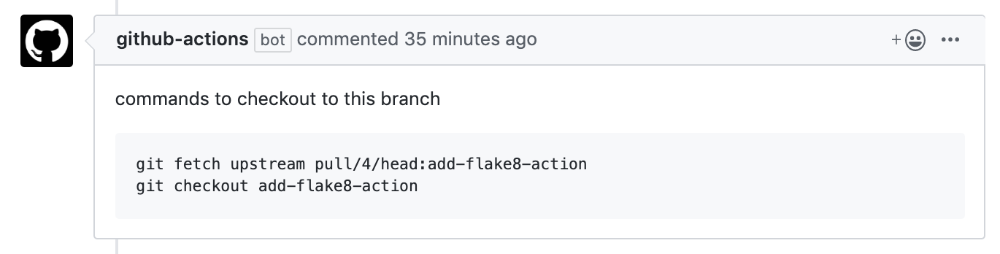

# Comment on PR

A GitHub action to add a comment on pull requests.

## Usage Example

[`.github/workflows/example.yml`](.github/workflows/example.yml)

```yml
name: Add checkout commands
on: pull_request
jobs:
  comment:
    name: Add checkout commands
    runs-on: ubuntu-latest
    steps:
      - uses: actions/checkout@master
      - uses: harupy/comment-on-pr@master
        env:
          GITHUB_TOKEN: ${{ secrets.GITHUB_TOKEN }}
        with:
          template: template.md
```

[`.github/workflows/template.md`](.github/workflows/template.md)

````markdown
commands to checkout to this branch

```
git fetch upstream pull/{pull_id}/head:{branch_name}
git checkout {branch_name}
```
````

The template above creates:



### Update comment

If the `updatecomment` argument is provided then the action will
attempt to update the previously posted comment, identified by the
appended comment tag.

This is useful for when the content of the message is changing but you
don't want a notification on each comment.
The comment will be appended with:
> *comment tag*: uniquetag

```yml
name: Add checkout commands
on: pull_request
jobs:
  comment:
    name: Add checkout commands
    runs-on: ubuntu-latest
    steps:
      - uses: actions/checkout@master
      - uses: harupy/comment-on-pr@master
        env:
          GITHUB_TOKEN: ${{ secrets.GITHUB_TOKEN }}
        with:
          template: template.md
          updatecomment: uniquetag
```
